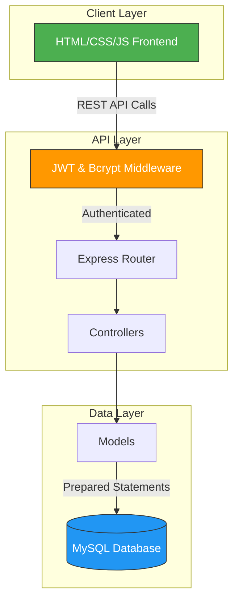
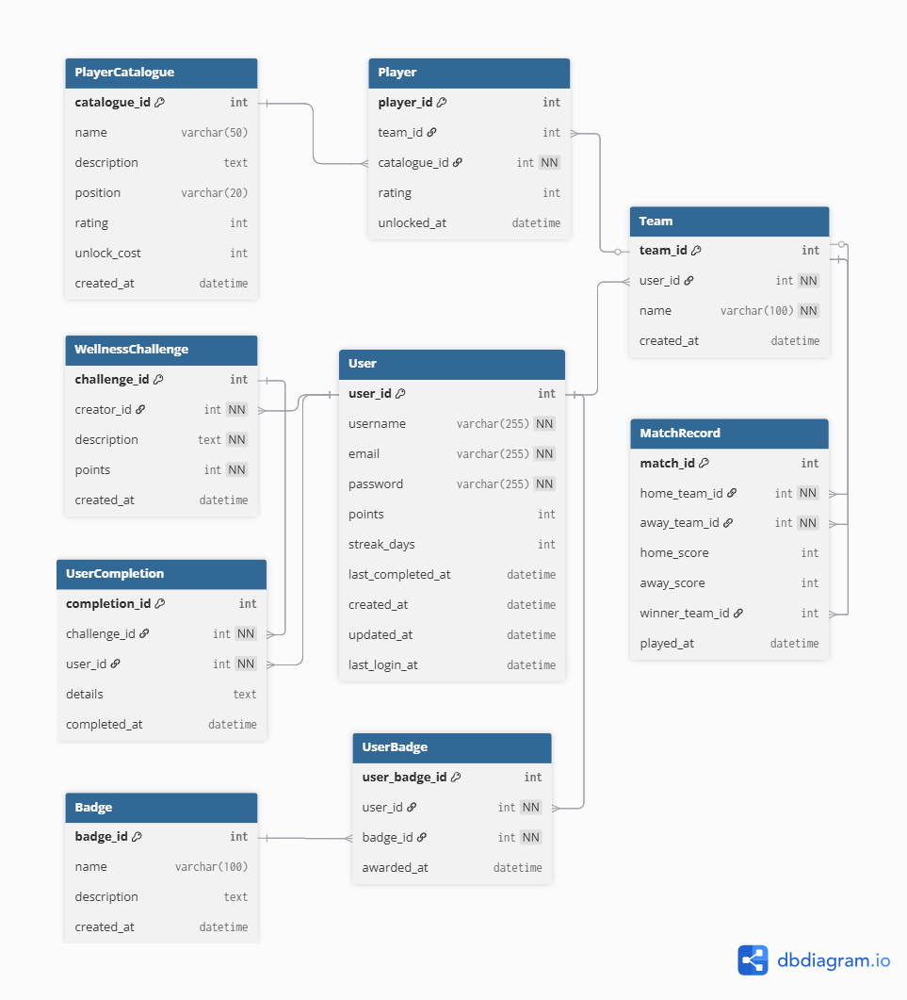

# Kickoff — Football-Themed Wellness Gamification Platform

[](https://nodejs.org/)
[](https://expressjs.com/)
[](https://www.mysql.com/)
[](https://jwt.io/)
[](https://opensource.org/licenses/ISC)

A full-stack wellness gamification platform that incentivizes healthy habits through a football management reward system. Users complete daily wellness challenges to earn points, which are then spent on building competitive football teams in a simulated transfer market. The application features JWT-based authentication, role-based access control, and a responsive vanilla JavaScript frontend.

## 📱 Project Preview


_1. Profile Dashboard — A centralized overview of wellness metrics, point balances, daily streaks, and football team status._


_2. Wellness Challenges — Interactive interface for managing daily health tasks and earning points through completion validation._


_3. Transfer Market — An integrated economy allowing users to exchange wellness points for high-value player acquisitions._


_4. Team Management — Full control over team composition, including player tracking and squad optimization._


_5. Achievement System — Visual representation of earned milestones, rewarded automatically for consistency and specific accomplishments._

## 🏗️ System Architecture



The application follows a layered **Model-View-Controller (MVC)** architecture with clear separation of concerns:

- **Middleware Layer**: JWT token verification and bcrypt password hashing intercept all authenticated routes before reaching controllers.
- **Controller Layer**: Decoupled handlers managing complex business logic (streak calculations, point transactions, match simulations).
- **Model Layer**: Database interaction via parameterized queries, eliminating SQL injection vulnerabilities.
- **Static Layer**: Vanilla HTML/CSS/JS frontend served via Express static middleware.

## 📊 Database Design

The system architecture is supported by a relational database schema designed for high data integrity and performance:


_Entity Relationship Diagram (ERD) for Kickoff Platform_

## 🚀 Core Features

### 🏃 Wellness Gamification

- **Dynamic Challenges**: Full CRUD system for health-centric tasks with daily reset mechanics.
- **Streak Tracking**: Automated consecutive-day completion tracking with bonus point multipliers.
- **Points Economy**: Wellness milestones convert into spendable currency for the football management layer.

### ⚽ Football Manager

- **Team Ecosystem**: Full team lifecycle management; creation, roster building, and tactical oversight.
- **Transfer Market**: A simulated economy where wellness points are exchanged for player acquisitions.
- **Match Simulation**: Logic-based matchmaking engine supporting PvP and PvAI encounters, with persistent statistics and leaderboard tracking.

### 🏅 Achievement & Badge System

- Event-driven badge allocation triggered by milestone completions (e.g., "Consistency King", "Hat Trick", "First Goal").

### 🧑 Authentication & Authorization

- **JWT-Based Auth**: Stateless token authentication for all protected endpoints.
- **Bcrypt Hashing**: Industry-standard password hashing with salt rounds.
- **Role-Based Access**: Tiered permissions; standard users, team owners, challenge creators, and superadmin.
- **File Uploads**: Multer-based middleware for user profile image handling.

## 🛠️ Tech Stack

| Layer        | Technology                                              |
| :----------- | :------------------------------------------------------ |
| **Runtime**  | Node.js + Express.js 5.x                                |
| **Database** | MySQL (via `mysql2` with connection pooling)            |
| **Auth**     | JSON Web Tokens (`jsonwebtoken`) + `bcrypt`             |
| **Uploads**  | `multer` for multipart form-data handling               |
| **Frontend** | Vanilla HTML5, CSS3, JavaScript (no framework)          |
| **Security** | Parameterized queries, JWT middleware, ownership checks |

## ⚙️ Installation & Setup

### 1. Environment Configuration

Create a `.env` file in the root directory:

```env
DB_HOST=localhost
DB_USER=your_user
DB_PASSWORD=your_password
DB_DATABASE=kickoff
DB_PORT=3306
```

### 2. Dependency Installation

```bash
npm install
```

### 3. Database Initialization

This command creates the schema and populates initial data (player catalogues, challenge metadata, superadmin account):

```bash
npm run init_tables
```

### 4. Launch

```bash
npm run dev
```

The application is accessible at `http://localhost:3000`.

## 📡 API Reference

### Authentication & Users

| Method | Endpoint       | Description                  | Auth   |
| :----- | :------------- | :--------------------------- | :----- |
| `POST` | `/users`       | Register a new user          | Public |
| `POST` | `/users/login` | Authenticate and receive JWT | Public |
| `GET`  | `/users`       | List all users               | JWT    |
| `GET`  | `/users/:id`   | Retrieve user details        | JWT    |
| `PUT`  | `/users/:id`   | Update user (Owner only)     | JWT    |

### Wellness Challenges

| Method   | Endpoint          | Description                     | Auth |
| :------- | :---------------- | :------------------------------ | :--- |
| `POST`   | `/challenges`     | Create a challenge              | JWT  |
| `GET`    | `/challenges`     | List all challenges             | JWT  |
| `PUT`    | `/challenges/:id` | Update challenge (Creator only) | JWT  |
| `DELETE` | `/challenges/:id` | Delete challenge (Creator only) | JWT  |
| `POST`   | `/challenges/:id` | Complete a challenge            | JWT  |
| `GET`    | `/challenges/:id` | View completion history         | JWT  |

### Teams, Players & Matches

| Method   | Endpoint                  | Description          | Auth |
| :------- | :------------------------ | :------------------- | :--- |
| `POST`   | `/teams`                  | Create a team        | JWT  |
| `GET`    | `/teams/:id`              | Get team details     | JWT  |
| `GET`    | `/teams/:team_id/players` | Get team roster      | JWT  |
| `POST`   | `/players/:id/unlock`     | Purchase a player    | JWT  |
| `DELETE` | `/players/:id`            | Release a player     | JWT  |
| `POST`   | `/matches/match`          | Simulate a match     | JWT  |
| `GET`    | `/matches/leaderboard`    | View win leaderboard | JWT  |

## 📂 Repository Structure

```
├── public/                     # Frontend (Static Assets)
│   ├── css/                    # Stylesheets
│   ├── images/                 # Static media
│   ├── js/
│   │   ├── admin/              # Admin dashboard scripts
│   │   ├── auth/               # Login & registration logic
│   │   ├── core/               # Shared utilities (API wrapper, UI helpers)
│   │   └── features/           # Feature modules
│   │       ├── challenges/     # Challenge interaction logic
│   │       ├── matches/        # Match simulation UI
│   │       ├── players/        # Market & player cards
│   │       ├── profile/        # User profile management
│   │       └── team/           # Team roster management
│   └── *.html                  # Application pages
│
├── src/                        # Backend (Node.js/Express)
│   ├── app.js                  # Express app setup
│   ├── configs/                # Database schema & initialization
│   ├── controllers/            # Route handlers & business logic
│   ├── middlewares/            # JWT auth, bcrypt, file upload
│   ├── models/                 # Database query layer
│   ├── routes/                 # API endpoint definitions
│   └── services/               # Database connectivity utilities
│
├── index.js                    # Server entry point
├── kickoff_ERD.png             # Database Entity Relationship Diagram
├── Kickoff.postman_collection  # Postman collection for API testing
├── package.json                # Project dependencies
└── .env                        # Environment configuration
```

## 🔐 Security Implementation

- **JWT Authentication**: All protected routes require a valid Bearer token in the `Authorization` header.
- **Password Hashing**: User passwords are hashed using bcrypt with configurable salt rounds before storage.
- **Ownership Middleware**: Granular access control ensures users can only modify resources they own.
- **SQL Injection Prevention**: Universal use of parameterized queries (`?` placeholders) across all database interactions.
- **Superadmin Protection**: Destructive operations (user deletion) are restricted to the superadmin role.

## 🧪 API Verification & Testing

The API surface has been strictly tested for functional correctness and security:

- **Postman Collection**: A comprehensive test suite is included in `Kickoff.postman_collection.json`, covering all CRUD operations, authentication flows, and edge-case error handling.
- **Manual Verification**: End-to-end testing of the points-to-market lifecycle to ensure transaction atomicity and streak accuracy.

## 🔮 Future Roadmap

Planned enhancements to evolve the platform:

- **Interactive Match Management**: Transitioning from passive simulations to tactical real-time management, allowing users to influence match outcomes through substitutions or formation shifts.
- **Social Ecosystem**: Implementing global leaderboards based on win rates and wellness streaks, alongside direct head-to-head wellness challenges between friends.
- **Player Progression System**: An experience (XP) and leveling mechanic where purchased players improve their attributes based on match performance.

---

_Developed by Adita Putri Puspaningrum._
